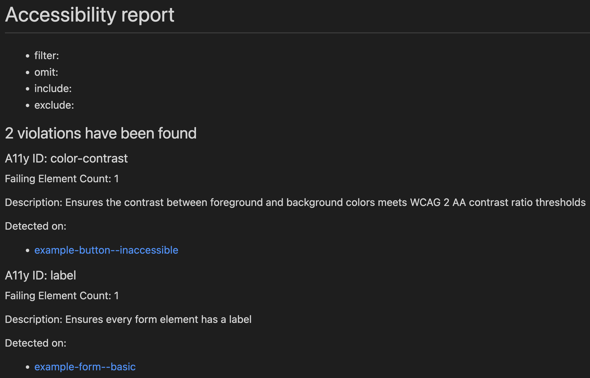

# storybook-a11y-report

CLI tool for [storybook-addon-a11y](https://github.com/storybookjs/storybook/tree/next/addons/a11y).

# storybook-a11y-report is no longer maintained, please use Storybook test runner and axe-playwright instead!

The storybook-a11y-report project is now discontinued.
Please switch to the Storybook test runner and axe-playwright for accessibility testing.
We thank everyone who supported storybook-a11y-report throughout its journey.

## Report Example



## Getting Started

### Prerequisites

If you are already developing in Storybook and storybook-addon-a11y is working, this module will work.
If storybook-addon-a11y is not installed, start with [this guide](https://github.com/storybookjs/storybook/tree/next/addons/a11y#getting-started).

### Installing / Getting started

```sh
# Locally in your project.
npm install -D storybook-a11y-report

# Or globally.
npm install -g storybook-a11y-report

# You will need to start Storybook before running this command.
npx storybook-a11y-report
```

## Options

```text
--include, -i   Name of stories to narrow down (supports minimatch)
--exclude, -e   Name of stories to ignore (supports minimatch)
--filter, -f    ID of A11y to narrow down
--omit, -o      ID of A11y to ignore
--exit, -q      The process will be terminated abnormally, if there is an a11y violation in the report result (mainly for CI)
--storybookUrl  URL of Storybook (default: 'http://localhost:6006')
--outDir        Directory to output the report file (default: '__report__')
--outputFormat  Format of the output report, supports md or html (default: md)
```

## Built With

- [Storycrawler](https://github.com/reg-viz/storycap/tree/master/packages/storycrawler) - Utilities to build Storybook crawling tools with Puppeteer
- [storybook-addon-a11y](https://github.com/storybookjs/storybook/tree/next/code/addons/a11y) - Test components for user accessibility in Storybook
- [minimatch](https://github.com/isaacs/minimatch) - A minimal matching utility

## License

This project is licensed under the MIT License - see the [LICENSE](LICENSE) file for details.
